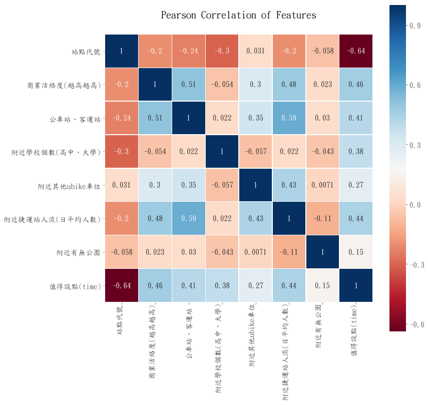
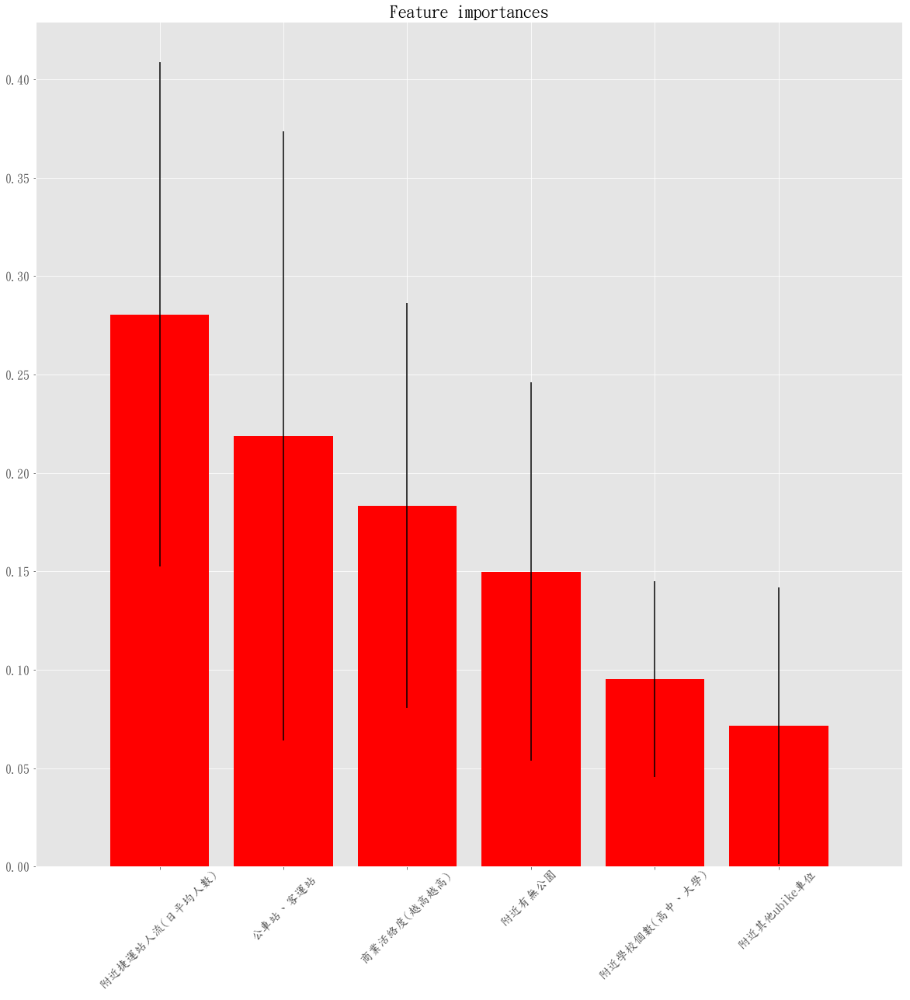
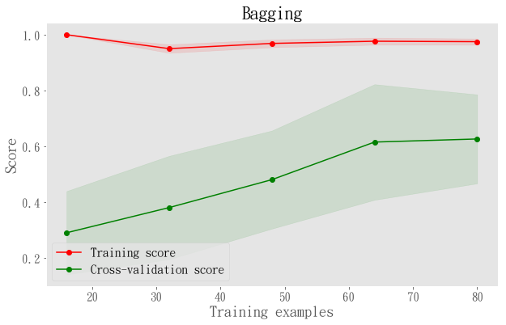
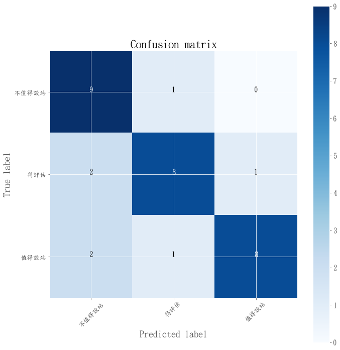

# Youbike增設站點預測模型

### 為協助Youbike營運商評估增站與否，本專題建立智慧選點模型， 並搭配Bagging(Bootstrap Aggregating)演算法以協助Youbike營運商評估哪些站點有較⾼的機率成為熱⾨站點

## 1. 資料準備


```python
### 導入所需套件
import pandas as pd
import numpy as np
import matplotlib.pyplot as plt
import seaborn as sns
%matplotlib inline

#設定介面與字型
plt.style.use('ggplot')
#plt.rcParams['font.family'] = 'SimHei'
plt.rcParams['font.family']='DFKai-SB'
plt.rcParams['axes.unicode_minus']=False 


train = pd.read_csv('point_data_cold_hot_predict1.csv', encoding='utf-8')
```

### 1.1資料預處理 

### （1）推測影響Youbike站點冷熱門的因素有二：（A）需求面因素：附近有學校、捷運、商業區、商圈、公園；（B)供給替代面：附近其他Youbike站、公車站、客運站。針對前述特徵進行資料的蒐集


```python
train.head()
```


<div>
<style scoped>
    .dataframe tbody tr th:only-of-type {
        vertical-align: middle;
    }

    .dataframe tbody tr th {
        vertical-align: top;
    }

    .dataframe thead th {
        text-align: right;
    }
</style>
<table border="1" class="dataframe">
  <thead>
    <tr style="text-align: right;">
      <th></th>
      <th>uid</th>
      <th>站點代號</th>
      <th>站點名稱(中文)</th>
      <th>總停車格</th>
      <th>緯度</th>
      <th>經度</th>
      <th>附近是否有商業區/工業區</th>
      <th>商業活絡度(越低越高)</th>
      <th>商業活絡度(越高越高)</th>
      <th>公車站、客運站</th>
      <th>...</th>
      <th>附近學校個數(高中、大學)</th>
      <th>附近捷運站個數</th>
      <th>附近其他ubike個數</th>
      <th>附近其他ubike車位</th>
      <th>所在的鄉鎮市區</th>
      <th>附近捷運站人流(日平均人數)</th>
      <th>附近有無公園</th>
      <th>值得設點(scale)</th>
      <th>值得設點(time)</th>
      <th>feature</th>
    </tr>
  </thead>
  <tbody>
    <tr>
      <th>0</th>
      <td>1</td>
      <td>264</td>
      <td>秀山區民活動中心</td>
      <td>28.0</td>
      <td>25.145936</td>
      <td>121.493009</td>
      <td>0</td>
      <td>5</td>
      <td>2</td>
      <td>7</td>
      <td>...</td>
      <td>1</td>
      <td>0</td>
      <td>0</td>
      <td>0</td>
      <td>北投區</td>
      <td>0</td>
      <td>0</td>
      <td>0.0</td>
      <td>0.0</td>
      <td>0</td>
    </tr>
    <tr>
      <th>1</th>
      <td>2</td>
      <td>205</td>
      <td>木柵光輝路口</td>
      <td>28.0</td>
      <td>24.988241</td>
      <td>121.555610</td>
      <td>0</td>
      <td>4</td>
      <td>3</td>
      <td>8</td>
      <td>...</td>
      <td>0</td>
      <td>0</td>
      <td>0</td>
      <td>0</td>
      <td>文山區</td>
      <td>0</td>
      <td>0</td>
      <td>0.0</td>
      <td>0.0</td>
      <td>0</td>
    </tr>
    <tr>
      <th>2</th>
      <td>3</td>
      <td>207</td>
      <td>福安國中</td>
      <td>30.0</td>
      <td>25.103242</td>
      <td>121.487477</td>
      <td>0</td>
      <td>6</td>
      <td>1</td>
      <td>5</td>
      <td>...</td>
      <td>0</td>
      <td>0</td>
      <td>0</td>
      <td>0</td>
      <td>士林區</td>
      <td>0</td>
      <td>0</td>
      <td>0.0</td>
      <td>0.0</td>
      <td>0</td>
    </tr>
    <tr>
      <th>3</th>
      <td>4</td>
      <td>243</td>
      <td>社子公園</td>
      <td>30.0</td>
      <td>25.090202</td>
      <td>121.506219</td>
      <td>1</td>
      <td>5</td>
      <td>2</td>
      <td>13</td>
      <td>...</td>
      <td>0</td>
      <td>0</td>
      <td>0</td>
      <td>0</td>
      <td>士林區</td>
      <td>0</td>
      <td>0</td>
      <td>0.0</td>
      <td>0.0</td>
      <td>0</td>
    </tr>
    <tr>
      <th>4</th>
      <td>5</td>
      <td>381</td>
      <td>民權東路六段15巷</td>
      <td>30.0</td>
      <td>25.068530</td>
      <td>121.578125</td>
      <td>1</td>
      <td>4</td>
      <td>3</td>
      <td>8</td>
      <td>...</td>
      <td>0</td>
      <td>0</td>
      <td>1</td>
      <td>34</td>
      <td>內湖區</td>
      <td>0</td>
      <td>1</td>
      <td>0.0</td>
      <td>0.0</td>
      <td>0</td>
    </tr>
  </tbody>
</table>
<p>5 rows × 24 columns</p>
</div>


```python
train2 = train.drop(labels = ["站點名稱(中文)","緯度","經度","總停車格","附近捷運站個數","附近是否有商業區/工業區", \
                              "商業活絡度(越低越高)","交通易達度(越低越高)", "feature", "uid",\
                              "附近是否有住宅區", "交通易達度(越高越高)", "附近其他ubike個數", "值得設點(scale)", "附近學校個數"], axis = 1)
```

### (2)利用One-hot encoding處理「所在的鄉鎮市區」等類別資料


```python
train2["所在的鄉鎮市區(整理)"] = train2["所在的鄉鎮市區"].map({"內湖區":0, "南港區":1, "文山區":2,  
                                               "北投區":3, "萬華區":4, "士林區":5 , "中山區":6,
                                              "松山區":7, "信義區":8, "大同區":9, "中正區":10,
                                              "大安區":11})
```


```python
train3 = train2.drop(labels = ["所在的鄉鎮市區", "所在的鄉鎮市區(整理)"], axis = 1)
```


```python
train3.set_index("站點代號",drop = True).head()
```


<div>
<style scoped>
    .dataframe tbody tr th:only-of-type {
        vertical-align: middle;
    }

    .dataframe tbody tr th {
        vertical-align: top;
    }

    .dataframe thead th {
        text-align: right;
    }
</style>
<table border="1" class="dataframe">
  <thead>
    <tr style="text-align: right;">
      <th></th>
      <th>商業活絡度(越高越高)</th>
      <th>公車站、客運站</th>
      <th>附近學校個數(高中、大學)</th>
      <th>附近其他ubike車位</th>
      <th>附近捷運站人流(日平均人數)</th>
      <th>附近有無公園</th>
      <th>值得設點(time)</th>
    </tr>
    <tr>
      <th>站點代號</th>
      <th></th>
      <th></th>
      <th></th>
      <th></th>
      <th></th>
      <th></th>
      <th></th>
    </tr>
  </thead>
  <tbody>
    <tr>
      <th>264</th>
      <td>2</td>
      <td>7</td>
      <td>1</td>
      <td>0</td>
      <td>0</td>
      <td>0</td>
      <td>0.0</td>
    </tr>
    <tr>
      <th>205</th>
      <td>3</td>
      <td>8</td>
      <td>0</td>
      <td>0</td>
      <td>0</td>
      <td>0</td>
      <td>0.0</td>
    </tr>
    <tr>
      <th>207</th>
      <td>1</td>
      <td>5</td>
      <td>0</td>
      <td>0</td>
      <td>0</td>
      <td>0</td>
      <td>0.0</td>
    </tr>
    <tr>
      <th>243</th>
      <td>2</td>
      <td>13</td>
      <td>0</td>
      <td>0</td>
      <td>0</td>
      <td>0</td>
      <td>0.0</td>
    </tr>
    <tr>
      <th>381</th>
      <td>3</td>
      <td>8</td>
      <td>0</td>
      <td>34</td>
      <td>0</td>
      <td>1</td>
      <td>0.0</td>
    </tr>
  </tbody>
</table>
</div>


### 1.2 整理測試資料集


```python
X_test=train3[train3['值得設點(time)'].isnull()]
X_test.head()
```


<div>
<style scoped>
    .dataframe tbody tr th:only-of-type {
        vertical-align: middle;
    }

    .dataframe tbody tr th {
        vertical-align: top;
    }

    .dataframe thead th {
        text-align: right;
    }
</style>
<table border="1" class="dataframe">
  <thead>
    <tr style="text-align: right;">
      <th></th>
      <th>站點代號</th>
      <th>商業活絡度(越高越高)</th>
      <th>公車站、客運站</th>
      <th>附近學校個數(高中、大學)</th>
      <th>附近其他ubike車位</th>
      <th>附近捷運站人流(日平均人數)</th>
      <th>附近有無公園</th>
      <th>值得設點(time)</th>
    </tr>
  </thead>
  <tbody>
    <tr>
      <th>89</th>
      <td>R03</td>
      <td>3</td>
      <td>12</td>
      <td>1</td>
      <td>0</td>
      <td>10206</td>
      <td>1</td>
      <td>NaN</td>
    </tr>
    <tr>
      <th>90</th>
      <td>L01</td>
      <td>4</td>
      <td>12</td>
      <td>0</td>
      <td>0</td>
      <td>29666</td>
      <td>1</td>
      <td>NaN</td>
    </tr>
    <tr>
      <th>91</th>
      <td>L02</td>
      <td>1</td>
      <td>1</td>
      <td>0</td>
      <td>0</td>
      <td>0</td>
      <td>1</td>
      <td>NaN</td>
    </tr>
    <tr>
      <th>92</th>
      <td>L03</td>
      <td>5</td>
      <td>14</td>
      <td>0</td>
      <td>0</td>
      <td>11455</td>
      <td>1</td>
      <td>NaN</td>
    </tr>
    <tr>
      <th>93</th>
      <td>L04</td>
      <td>4</td>
      <td>6</td>
      <td>0</td>
      <td>0</td>
      <td>0</td>
      <td>0</td>
      <td>NaN</td>
    </tr>
  </tbody>
</table>
</div>


### 1.3 整理訓練資料集


```python
train4=train3[~train3['值得設點(time)'].isnull()]
train4.head()
```


<div>
<style scoped>
    .dataframe tbody tr th:only-of-type {
        vertical-align: middle;
    }

    .dataframe tbody tr th {
        vertical-align: top;
    }

    .dataframe thead th {
        text-align: right;
    }
</style>
<table border="1" class="dataframe">
  <thead>
    <tr style="text-align: right;">
      <th></th>
      <th>站點代號</th>
      <th>商業活絡度(越高越高)</th>
      <th>公車站、客運站</th>
      <th>附近學校個數(高中、大學)</th>
      <th>附近其他ubike車位</th>
      <th>附近捷運站人流(日平均人數)</th>
      <th>附近有無公園</th>
      <th>值得設點(time)</th>
    </tr>
  </thead>
  <tbody>
    <tr>
      <th>0</th>
      <td>264</td>
      <td>2</td>
      <td>7</td>
      <td>1</td>
      <td>0</td>
      <td>0</td>
      <td>0</td>
      <td>0.0</td>
    </tr>
    <tr>
      <th>1</th>
      <td>205</td>
      <td>3</td>
      <td>8</td>
      <td>0</td>
      <td>0</td>
      <td>0</td>
      <td>0</td>
      <td>0.0</td>
    </tr>
    <tr>
      <th>2</th>
      <td>207</td>
      <td>1</td>
      <td>5</td>
      <td>0</td>
      <td>0</td>
      <td>0</td>
      <td>0</td>
      <td>0.0</td>
    </tr>
    <tr>
      <th>3</th>
      <td>243</td>
      <td>2</td>
      <td>13</td>
      <td>0</td>
      <td>0</td>
      <td>0</td>
      <td>0</td>
      <td>0.0</td>
    </tr>
    <tr>
      <th>4</th>
      <td>381</td>
      <td>3</td>
      <td>8</td>
      <td>0</td>
      <td>34</td>
      <td>0</td>
      <td>1</td>
      <td>0.0</td>
    </tr>
  </tbody>
</table>
</div>


### 1.4 繪製皮爾森相關係數圖


```python
#繪製關係圖
colormap = plt.cm.RdBu
# colormap = plt.cm.coolwarm
plt.figure(figsize=(12,12))
plt.title('Pearson Correlation of Features', y=1.05, size=20)
sns.heatmap(train4.astype(float).corr(),linewidths=0.1,vmax=1.0, square=True, 
            cmap=colormap, linecolor='white', annot=True)

plt.savefig("pearson_correlation.png")
plt.show()
```





## 2.Youbike冷熱站點預測模型的建立

### 2.1 採用三元分類模型：以「熱門、一般、冷門」等類型做為模型的預測變數；以1.1提出的特徵做為模型的特徵變數


```python
y = train4["值得設點(time)"]
X = train4.drop(labels =["值得設點(time)","站點代號"], axis = 1)
X_t=X_test.drop(labels =["值得設點(time)","站點代號"], axis = 1)
```


```python
from sklearn.model_selection import train_test_split
X_train, X_cv, y_train, y_cv = train_test_split(X, y, test_size = 0.35)
```


```python
from sklearn.preprocessing import StandardScaler
sc = StandardScaler()
sc.fit(X_train)
X_train_normalized = sc.transform(X_train)
X_cv_normalized = sc.transform(X_cv)
X_t_normalized = sc.transform(X_t)
```


```python
import matplotlib.pyplot as plt
import numpy as np
import itertools

def plot_confusion_matrix(cm, classes,
                          normalize=False,
                          title='Confusion matrix',
                          cmap=plt.cm.Blues):
    """
    This function prints and plots the confusion matrix.
    Normalization can be applied by setting `normalize=True`.
    """
    
    if normalize:
        cm = cm.astype('float') / cm.sum(axis=1)[:, np.newaxis]
        print("Normalized confusion matrix")
    else:
        print('Confusion matrix, without normalization')

    print(cm)
    
    plt.imshow(cm, interpolation='nearest', cmap=cmap)
    plt.title(title)
    plt.colorbar()
    tick_marks = np.arange(len(classes))
    plt.xticks(tick_marks, classes, rotation=45)
    plt.yticks(tick_marks, classes)
    
    thresh = cm.max() / 2.
    for i, j in itertools.product(range(cm.shape[0]), range(cm.shape[1])):
        plt.text(j, i, cm[i, j],
                 horizontalalignment="center",
                 color="white" if cm[i, j] > thresh else "black")

    plt.tight_layout()
    plt.ylabel('True label')
    plt.xlabel('Predicted label')
```


```python
# Scikit-Learn 官網作圖函式
print(__doc__)

import numpy as np
import matplotlib.pyplot as plt
from sklearn.model_selection import learning_curve
from sklearn.model_selection import ShuffleSplit


def plot_learning_curve(estimator, title, X, y, ylim=None, cv=None,
                        n_jobs=1, train_sizes=np.linspace(.1, 1.0, 5)):
   
    plt.figure(figsize=(10,6))  #調整作圖大小
    plt.title(title)
    if ylim is not None:
        plt.ylim(*ylim)
    plt.xlabel("Training examples")
    plt.ylabel("Score")
    train_sizes, train_scores, test_scores = learning_curve(
        estimator, X, y, cv=cv, n_jobs=n_jobs, train_sizes=train_sizes)
    train_scores_mean = np.mean(train_scores, axis=1)
    train_scores_std = np.std(train_scores, axis=1)
    test_scores_mean = np.mean(test_scores, axis=1)
    test_scores_std = np.std(test_scores, axis=1)
    plt.grid()

    plt.fill_between(train_sizes, train_scores_mean - train_scores_std,
                     train_scores_mean + train_scores_std, alpha=0.1,
                     color="r")
    plt.fill_between(train_sizes, test_scores_mean - test_scores_std,
                     test_scores_mean + test_scores_std, alpha=0.1, color="g")
    plt.plot(train_sizes, train_scores_mean, 'o-', color="r",
             label="Training score")
    plt.plot(train_sizes, test_scores_mean, 'o-', color="g",
             label="Cross-validation score")

    plt.legend(loc="best")
    return plt
```

    Automatically created module for IPython interactive environment
    

### 2.2 利用隨機森林模型來進行特徵重要性評估


```python
# RFC Parameters tunning
from sklearn.ensemble import RandomForestClassifier, AdaBoostClassifier, GradientBoostingClassifier, ExtraTreesClassifier, VotingClassifier
from sklearn.model_selection import GridSearchCV, cross_val_score, StratifiedKFold, learning_curve


RFC = RandomForestClassifier()
kfold = StratifiedKFold(n_splits=10)

## Search grid for optimal parameters
rf_param_grid = {"max_depth": [None],
              "max_features": ['sqrt'],
              "min_samples_split": [2, 3, 10],
              "min_samples_leaf": [1, 3, 10],
              "bootstrap": [False],
              "n_estimators" :[100,200],
              "criterion": ["gini"]}

gsRFC = GridSearchCV(RFC,param_grid = rf_param_grid, cv=kfold, scoring="accuracy", n_jobs= 2, verbose = 1)

gsRFC.fit(X_train_normalized, y_train.values.ravel())

RFC_best = gsRFC.best_estimator_

# Best score
print(gsRFC.best_score_)
```

    Fitting 10 folds for each of 18 candidates, totalling 180 fits
    

    [Parallel(n_jobs=2)]: Done  46 tasks      | elapsed:    4.3s
    

    0.5789473684210527
    

    [Parallel(n_jobs=2)]: Done 180 out of 180 | elapsed:   14.5s finished
    


```python
importances = RFC_best.feature_importances_
importances
```


    array([0.18353395, 0.21903063, 0.09534137, 0.07155878, 0.28055916,
           0.14997612])


```python
# X.sample(1)
```


```python
std = np.std([tree.feature_importances_ for tree in RFC_best.estimators_],
             axis=0)
indices = np.argsort(importances)[::-1]

# Print the feature ranking
print("Feature ranking:")

for f in range(X.shape[1]):
    print("%d. feature %d (%f)" % (f + 1, indices[f], importances[indices[f]]))

# Plot the feature importances of the forest
plt.figure(figsize=(20, 20))
plt.title("Feature importances")
plt.bar(range(X.shape[1]), importances[indices],
       color="r", yerr=std[indices], align="center")

plt.xticks(range(X.shape[1]), X.columns[indices] ,rotation=45)
plt.tick_params(labelsize=16)
#  plt.xticks(tick_marks, classes, rotation=45)
plt.xlim([-1, X.shape[1]])

plt.savefig("featuer_importances.png")
plt.show()
```

    Feature ranking:
    1. feature 4 (0.280559)
    2. feature 1 (0.219031)
    3. feature 0 (0.183534)
    4. feature 5 (0.149976)
    5. feature 2 (0.095341)
    6. feature 3 (0.071559)
    





## 3.利用Bagging分類演算法進行機器學習


```python
from sklearn.ensemble import BaggingClassifier
from sklearn import metrics

bagc = BaggingClassifier(bootstrap=True,bootstrap_features=True, warm_start=True,n_estimators=60, max_features=0.8, max_samples=0.8, random_state=10)
bagc.fit(X_train_normalized, y_train.values.ravel())
print(metrics.classification_report(y_cv, bagc.predict(X_cv_normalized)))
```

                 precision    recall  f1-score   support
    
            0.0       0.69      0.90      0.78        10
            1.0       0.80      0.73      0.76        11
            2.0       0.89      0.73      0.80        11
    
    avg / total       0.80      0.78      0.78        32
    
    


```python
#繪製學習曲線

# from plot_learning_curve import plot_learning_curve
from sklearn.model_selection import KFold
from sklearn import model_selection


cv = KFold(n_splits=10, shuffle=True)   
estimator = bagc
sc.fit(X)
plot_learning_curve(estimator, "Bagging", sc.transform(X), y.values.ravel(),  cv=cv, train_sizes=np.linspace(0.2, 1.0, 5))
results = model_selection.cross_val_score(bagc, sc.transform(X), y.values.ravel(), cv=cv)
plt.savefig("training_curve.png")
plt.show()
print(results.mean())
```





    0.6055555555555555
    


```python
#繪製coufusion matrix

from sklearn import metrics
estimator = bagc
print(metrics.classification_report(y_cv, estimator.predict(X_cv_normalized)))
print(metrics.confusion_matrix(y_cv, estimator.predict(X_cv_normalized)))

# from plot_confusion_matrix import plot_confusion_matrix
cnf_matrix = metrics.confusion_matrix(y_cv,estimator.predict(X_cv_normalized))

target_names = ['不值得設站','待評估', "值得設站"]
plt.figure(figsize=(10, 10))
plt.tick_params(labelsize=13)
plt.rcParams.update({'font.size': 15})
plot_confusion_matrix(cnf_matrix, classes=target_names)
plt.savefig("confusion_mstrix.png")
plt.show()
```

                 precision    recall  f1-score   support
    
            0.0       0.69      0.90      0.78        10
            1.0       0.80      0.73      0.76        11
            2.0       0.89      0.73      0.80        11
    
    avg / total       0.80      0.78      0.78        32
    
    [[9 1 0]
     [2 8 1]
     [2 1 8]]
    Confusion matrix, without normalization
    [[9 1 0]
     [2 8 1]
     [2 1 8]]
    





## 4. 利用訓練好的模型進行17個候選站點的預測

### 若預測結果為「冷門」站點，則視為「不值得設站」；若預測結果為「熱門」站點，則視為「值得設站」；若預測結果為「一般」站點，則視為「待評估」


```python
result=bagc.predict(X_t_normalized)
result
```


    array([1., 1., 1., 1., 0., 1., 2., 1., 0., 1., 2., 1., 1., 2., 2., 0., 2.,
           2.])


```python
name_list=['廣慈/奉天宮站', '福興聖誕公園', '洲美運動公園', '榮華里內', '承德與石牌路口', '中和街與復興四路口', '政大一街 8-9 號', '文山區三角公園',\
          '興福國中', '實踐國小', '力行國小', '華豐汽車駕訓班', '南港公園大門', '內湖公民會館', '陽光街與成功路三段', '仁愛臨沂街口',\
          '松山永吉路口', '市民大道敦南與延吉街']

result_list=list(result)

result_table={
    
    '站點名稱':name_list,
    '預測結果':result_list
}

df_result_table=pd.DataFrame(result_table)
df_result_table['預測結果(中文)']=df_result_table['預測結果'].map({0:'不值得設站', 1:'待評估', 2:'值得設站'})

df_result_table
```


<div>
<style scoped>
    .dataframe tbody tr th:only-of-type {
        vertical-align: middle;
    }

    .dataframe tbody tr th {
        vertical-align: top;
    }

    .dataframe thead th {
        text-align: right;
    }
</style>
<table border="1" class="dataframe">
  <thead>
    <tr style="text-align: right;">
      <th></th>
      <th>站點名稱</th>
      <th>預測結果</th>
      <th>預測結果(中文)</th>
    </tr>
  </thead>
  <tbody>
    <tr>
      <th>0</th>
      <td>廣慈/奉天宮站</td>
      <td>1.0</td>
      <td>待評估</td>
    </tr>
    <tr>
      <th>1</th>
      <td>福興聖誕公園</td>
      <td>1.0</td>
      <td>待評估</td>
    </tr>
    <tr>
      <th>2</th>
      <td>洲美運動公園</td>
      <td>1.0</td>
      <td>待評估</td>
    </tr>
    <tr>
      <th>3</th>
      <td>榮華里內</td>
      <td>1.0</td>
      <td>待評估</td>
    </tr>
    <tr>
      <th>4</th>
      <td>承德與石牌路口</td>
      <td>0.0</td>
      <td>不值得設站</td>
    </tr>
    <tr>
      <th>5</th>
      <td>中和街與復興四路口</td>
      <td>1.0</td>
      <td>待評估</td>
    </tr>
    <tr>
      <th>6</th>
      <td>政大一街 8-9 號</td>
      <td>2.0</td>
      <td>值得設站</td>
    </tr>
    <tr>
      <th>7</th>
      <td>文山區三角公園</td>
      <td>1.0</td>
      <td>待評估</td>
    </tr>
    <tr>
      <th>8</th>
      <td>興福國中</td>
      <td>0.0</td>
      <td>不值得設站</td>
    </tr>
    <tr>
      <th>9</th>
      <td>實踐國小</td>
      <td>1.0</td>
      <td>待評估</td>
    </tr>
    <tr>
      <th>10</th>
      <td>力行國小</td>
      <td>2.0</td>
      <td>值得設站</td>
    </tr>
    <tr>
      <th>11</th>
      <td>華豐汽車駕訓班</td>
      <td>1.0</td>
      <td>待評估</td>
    </tr>
    <tr>
      <th>12</th>
      <td>南港公園大門</td>
      <td>1.0</td>
      <td>待評估</td>
    </tr>
    <tr>
      <th>13</th>
      <td>內湖公民會館</td>
      <td>2.0</td>
      <td>值得設站</td>
    </tr>
    <tr>
      <th>14</th>
      <td>陽光街與成功路三段</td>
      <td>2.0</td>
      <td>值得設站</td>
    </tr>
    <tr>
      <th>15</th>
      <td>仁愛臨沂街口</td>
      <td>0.0</td>
      <td>不值得設站</td>
    </tr>
    <tr>
      <th>16</th>
      <td>松山永吉路口</td>
      <td>2.0</td>
      <td>值得設站</td>
    </tr>
    <tr>
      <th>17</th>
      <td>市民大道敦南與延吉街</td>
      <td>2.0</td>
      <td>值得設站</td>
    </tr>
  </tbody>
</table>
</div>


```python
name_list=['廣慈/奉天宮站', '福興聖誕公園', '洲美運動公園', '榮華里內', '承德與石牌路口', '中和街與復興四路口', '政大一街 8-9 號', '文山區三角公園',\
          '興福國中', '實踐國小', '力行國小', '華豐汽車駕訓班', '南港公園大門', '內湖公民會館', '陽光街與成功路三段', '仁愛臨沂街口',\
          '松山永吉路口', '市民大道敦南與延吉街']

nameID_list=['R03', 'L01', 'L02', 'L03', 'L04', 'L05', 'L06', 'L07', 'L08', 'L09', 'L10', 'L11', 'L12', 'L13', 'L14',\
            'L15', 'L16', 'L17']

result_list=list(result)

result_table={
    
    '站點代號':nameID_list,
    '站點名稱':name_list,
    '預測結果':result_list
}

df_result_table=pd.DataFrame(result_table)
df_result_table['預測結果(中文)']=df_result_table['預測結果'].map({0:'不值得設站', 1:'待評估', 2:'值得設站'})

df_result_table1=pd.merge(df_result_table, X_test, how='left', on='站點代號')

df_result_table2=df_result_table1.iloc[:,[0,1,2,3,4,5,6,7,8,9]]
# df_result_table2["所在的鄉鎮市區(中文)"]=df_result_table2["所在的鄉鎮市區(整理)"].map({0:"內湖區", 1:"南港區", 2:"文山區",  
#                                                3:"北投區", 4:"萬華區", 5:"士林區", 6:"中山區",7: "松山區", 8:"信義區",\
#                                                9:"大同區", 10:"中正區", 11:"大安區"})

df_result_table2.to_csv('df_result_table2_predict8b.csv', encoding='utf-8')
df_result_table2
```


<div>
<style scoped>
    .dataframe tbody tr th:only-of-type {
        vertical-align: middle;
    }

    .dataframe tbody tr th {
        vertical-align: top;
    }

    .dataframe thead th {
        text-align: right;
    }
</style>
<table border="1" class="dataframe">
  <thead>
    <tr style="text-align: right;">
      <th></th>
      <th>站點代號</th>
      <th>站點名稱</th>
      <th>預測結果</th>
      <th>預測結果(中文)</th>
      <th>商業活絡度(越高越高)</th>
      <th>公車站、客運站</th>
      <th>附近學校個數(高中、大學)</th>
      <th>附近其他ubike車位</th>
      <th>附近捷運站人流(日平均人數)</th>
      <th>附近有無公園</th>
    </tr>
  </thead>
  <tbody>
    <tr>
      <th>0</th>
      <td>R03</td>
      <td>廣慈/奉天宮站</td>
      <td>1.0</td>
      <td>待評估</td>
      <td>3</td>
      <td>12</td>
      <td>1</td>
      <td>0</td>
      <td>10206</td>
      <td>1</td>
    </tr>
    <tr>
      <th>1</th>
      <td>L01</td>
      <td>福興聖誕公園</td>
      <td>1.0</td>
      <td>待評估</td>
      <td>4</td>
      <td>12</td>
      <td>0</td>
      <td>0</td>
      <td>29666</td>
      <td>1</td>
    </tr>
    <tr>
      <th>2</th>
      <td>L02</td>
      <td>洲美運動公園</td>
      <td>1.0</td>
      <td>待評估</td>
      <td>1</td>
      <td>1</td>
      <td>0</td>
      <td>0</td>
      <td>0</td>
      <td>1</td>
    </tr>
    <tr>
      <th>3</th>
      <td>L03</td>
      <td>榮華里內</td>
      <td>1.0</td>
      <td>待評估</td>
      <td>5</td>
      <td>14</td>
      <td>0</td>
      <td>0</td>
      <td>11455</td>
      <td>1</td>
    </tr>
    <tr>
      <th>4</th>
      <td>L04</td>
      <td>承德與石牌路口</td>
      <td>0.0</td>
      <td>不值得設站</td>
      <td>4</td>
      <td>6</td>
      <td>0</td>
      <td>0</td>
      <td>0</td>
      <td>0</td>
    </tr>
    <tr>
      <th>5</th>
      <td>L05</td>
      <td>中和街與復興四路口</td>
      <td>1.0</td>
      <td>待評估</td>
      <td>4</td>
      <td>9</td>
      <td>1</td>
      <td>0</td>
      <td>0</td>
      <td>0</td>
    </tr>
    <tr>
      <th>6</th>
      <td>L06</td>
      <td>政大一街 8-9 號</td>
      <td>2.0</td>
      <td>值得設站</td>
      <td>2</td>
      <td>15</td>
      <td>1</td>
      <td>0</td>
      <td>0</td>
      <td>0</td>
    </tr>
    <tr>
      <th>7</th>
      <td>L07</td>
      <td>文山區三角公園</td>
      <td>1.0</td>
      <td>待評估</td>
      <td>1</td>
      <td>9</td>
      <td>1</td>
      <td>0</td>
      <td>0</td>
      <td>0</td>
    </tr>
    <tr>
      <th>8</th>
      <td>L08</td>
      <td>興福國中</td>
      <td>0.0</td>
      <td>不值得設站</td>
      <td>3</td>
      <td>5</td>
      <td>0</td>
      <td>0</td>
      <td>0</td>
      <td>0</td>
    </tr>
    <tr>
      <th>9</th>
      <td>L09</td>
      <td>實踐國小</td>
      <td>1.0</td>
      <td>待評估</td>
      <td>3</td>
      <td>12</td>
      <td>1</td>
      <td>0</td>
      <td>0</td>
      <td>0</td>
    </tr>
    <tr>
      <th>10</th>
      <td>L10</td>
      <td>力行國小</td>
      <td>2.0</td>
      <td>值得設站</td>
      <td>5</td>
      <td>11</td>
      <td>1</td>
      <td>0</td>
      <td>0</td>
      <td>0</td>
    </tr>
    <tr>
      <th>11</th>
      <td>L11</td>
      <td>華豐汽車駕訓班</td>
      <td>1.0</td>
      <td>待評估</td>
      <td>3</td>
      <td>11</td>
      <td>0</td>
      <td>0</td>
      <td>0</td>
      <td>1</td>
    </tr>
    <tr>
      <th>12</th>
      <td>L12</td>
      <td>南港公園大門</td>
      <td>1.0</td>
      <td>待評估</td>
      <td>2</td>
      <td>5</td>
      <td>0</td>
      <td>0</td>
      <td>13347</td>
      <td>1</td>
    </tr>
    <tr>
      <th>13</th>
      <td>L13</td>
      <td>內湖公民會館</td>
      <td>2.0</td>
      <td>值得設站</td>
      <td>6</td>
      <td>20</td>
      <td>1</td>
      <td>0</td>
      <td>7970</td>
      <td>0</td>
    </tr>
    <tr>
      <th>14</th>
      <td>L14</td>
      <td>陽光街與成功路三段</td>
      <td>2.0</td>
      <td>值得設站</td>
      <td>6</td>
      <td>20</td>
      <td>2</td>
      <td>0</td>
      <td>5028</td>
      <td>0</td>
    </tr>
    <tr>
      <th>15</th>
      <td>L15</td>
      <td>仁愛臨沂街口</td>
      <td>0.0</td>
      <td>不值得設站</td>
      <td>3</td>
      <td>21</td>
      <td>0</td>
      <td>0</td>
      <td>0</td>
      <td>0</td>
    </tr>
    <tr>
      <th>16</th>
      <td>L16</td>
      <td>松山永吉路口</td>
      <td>2.0</td>
      <td>值得設站</td>
      <td>5</td>
      <td>22</td>
      <td>0</td>
      <td>0</td>
      <td>16008</td>
      <td>0</td>
    </tr>
    <tr>
      <th>17</th>
      <td>L17</td>
      <td>市民大道敦南與延吉街</td>
      <td>2.0</td>
      <td>值得設站</td>
      <td>5</td>
      <td>14</td>
      <td>0</td>
      <td>0</td>
      <td>38292</td>
      <td>0</td>
    </tr>
  </tbody>
</table>
</div>


